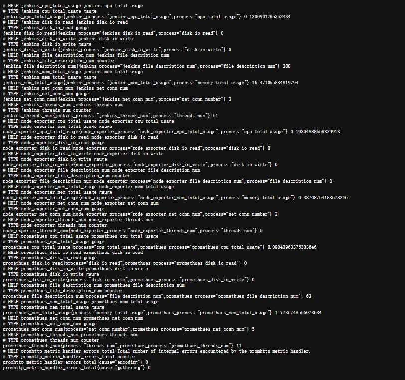

## p_exporter

* 说明    
  采集指定进程的系统资源使用情况:    
  cpu    
  memory    
  disk io   
  网络连接数量    
  进程打开的文件描述符数量    
  进程中开启的线程数量    
  ...    
  当被采集的进程停止运行或读取pid.txt文件发生异常时,    
  采集的数据为代码中采集进程资源返回的异常数据    

* 注意    
被采集的进程的运行目录下需要pid.txt文件记录进程的进程号

* 数据导出格式    
  
